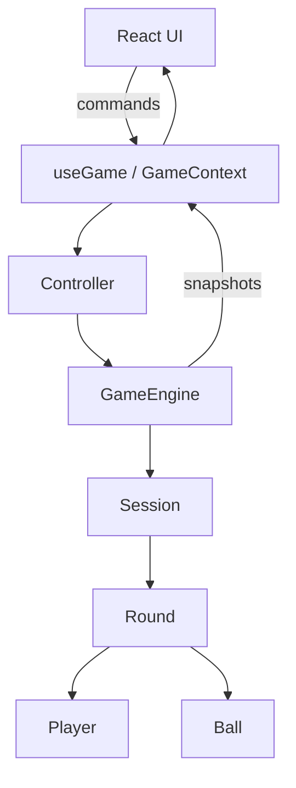

# Pool Master — Engine & Architecture (v1.1)

## Purpose and audience

This document is a technical reference for engineers working on Pool Master. It explains the architecture, data model, runtime invariants, public APIs, persistence model, testing strategy, and contribution notes. It assumes familiarity with React, JavaScript/Node module patterns, and common engineering practices.

## Executive summary

Pool Master is a local-first pool score tracking application built around a headless, domain-driven game engine. The engine contains all business logic (scoring, fouls, round rules, player ordering, persistence) and exposes a minimal controller API consumed by a React UI. The design enforces a single source of truth: the engine. React only renders immutable snapshots produced by the engine.

**Key guarantees**

- The engine is authoritative for all game rules and state transitions.
- All mutations are performed inside the engine; callers receive immutable snapshots after each command.
- Snapshots are serializable and restorable; restoration reattaches prototypes so objects regain behavior.

## High-level architecture

The runtime layers are:

- React UI (components/pages)
- useGame hook / GameContext (bridging React and the controller)
- Controller (command API, validation, and snapshot returns)
- GameEngine (top-level coordinator)
- Session (session lifecycle, rounds, players)
- Round (scoring rules, ball availability, fouls)
- Player / Ball (domain primitives)

Mermaid diagram

Files to inspect

- Controller implementation: [src/logic/controller.js](src/logic/controller.js)
- Engine core: [src/logic/gameEngine.js](src/logic/gameEngine.js)
- Session/round/player: [src/logic/session.js](src/logic/session.js), [src/logic/round.js](src/logic/round.js), [src/logic/player.js](src/logic/player.js)
- React bridge: [src/hooks/useGame.js](src/hooks/useGame.js), [src/context/GameProvider.jsx](src/context/GameProvider.jsx)

## Domain model (detailed)

Ball

- Identity: `id`, `ballNo`
- Properties: `value`, `isPotted`
- Value rule: ball numeric value equals ball number except ball 3 which maps to value 6 (breaker behavior)
- Behavior: `potted()` marks unavailable. `restoreBall()` reconstructs from persisted snapshot.

Player

- Identity: `id`, `name`
- Runtime state during a round: `{ isKnocked, isActive, ballBasket: [], score }`
- Score derivation: computed from `ballBasket` (source of truth for a player's score)
- Scoring API: `potBall(ball)`, `potCueBall(ball)`, `hitWrongBall(ball)`, `calculateScore()`
- Persistence: `getSnapshot()` and `restorePlayer()` for serialization and rehydration

Round

- Owner of gameplay rules for a single round
- Responsibilities: track available balls, current scoring ball, process scoring commands, apply fouls (cue scratch, wrong-hit), determine winner
- Ball selection rules: if ball 3 is available it becomes the current (breaker); otherwise lowest available ball
- Public methods: `recordScore(playerId, ballId)`, `recordCueScratch(playerId)`, `recordWrongHit(playerId, ballId)`, `determineWinner()`, `getSnapshot()`, `restoreRound()`

Session

- Holds participating players, completed rounds, active round reference, mode, and player ordering logic
- Round lifecycle: `startNewRound()`, `endCurrentRound()`, `saveCurrentRound()`
- Player order rules: previous round winner breaks; remaining players sorted by descending score; ties randomized (affects only next round)

GameEngine

- Top-level coordinator. Owns player repository, active session, archived sessions, and available modes
- Player management commands: `addPlayer(name)`, `addLatePlayer(name)`, `deletePlayer(id)`
- Session commands: `startNewSession()`, `startNewRound()`, `endCurrentRound()`, `endCurrentSession()`
- Persistence APIs: `getSnapshot()`, `restoreEngine(data)`

Controller

- Thin, well-validated API between UI and engine
- Every mutating command returns an immutable snapshot to be set in React state
- Typical commands: `addPlayer`, `deletePlayer`, `startNewSession`, `startNewRound`, `recordScore`, `recordCueScratch`, `recordWrongHit`, `endCurrentRound`, `endCurrentSession`
- Reads (non-mutating): queries for engine snapshot, player list, session history

React integration

- `useGame` hook wraps controller calls and persists snapshot results to localStorage
- UI components subscribe to `GameContext` and render based on immutable snapshots

## Snapshot & persistence model (behavioral contract)

Snapshot characteristics

- Immutable: callers must not depend on modifying snapshot objects
- Deep: snapshots include nested rounds, players, and balls
- Deterministic: snapshot generation stores any derived values required for rendering and history (scores, winner, availableBalls)

Persistence

- Storage: browser `localStorage` by default (see controller persistence helpers)
- Stored artifact: full `GameEngine` snapshot

Restore process

1. Parse JSON into plain objects
2. Reconstruct domain instances and reattach prototypes (`restorePlayer`, `restoreRound`, `restoreSession`, `restoreEngine`)
3. Validate invariants (player ids unique, ball availability matches round state)

Important invariants to enforce on restore

- All player ids are unique
- Balls referenced in player baskets must exist and be marked potted in the round's availableBalls
- Round winner only recorded when round is complete

## Concurrency, isolation, and UI expectations

- Single-threaded environment (browser); the engine assumes commands are executed sequentially
- Controller is responsible for input validation and returning snapshots after each command; UI should treat each snapshot as canonical
- Long-running or async operations (persistence) complete synchronously from the caller POV — the controller persists and returns an updated snapshot

## Error handling and edge cases

- Invalid commands (e.g., potting an already potted ball) return a no-op with a validated error or a consistent, documented snapshot state — see controller validation
- Tie-breakers: ties are resolved randomly; implement deterministic seeding only when reproducible replay is required
- Late player addition during an active session: currently treated same as `addPlayer` but flagged in TODOs (see Planned)

## Testing strategy

- Unit tests for domain primitives (Player, Ball, Round) to verify score calculation, fouls, and potted logic
- Integration tests for Session → Round transitions and ordering rules
- Persistence tests: round-trip snapshot → restore → behavior equivalence
- UI-level smoke tests to verify controller integration with `useGame`

Recommended test targets and sample assertions

- `potBall` increases player basket & score by ball value
- `recordCueScratch` applies negative of current ball value
- `startNewRound` sets the breaker correctly when ball 3 remains

## Performance considerations

- Snapshot generation performs deep cloning; keep snapshots as compact as possible (prune transient debugging fields)
- Avoid expensive computations in render path; compute derived values once in the engine and attach them to snapshots

## Migration & integration notes

- The engine is headless and portable — it can be extracted into a separate package or bundled for mobile and server use
- Persistence can be swapped to IndexedDB or remote storage by replacing controller persistence helpers

## Contribution & developer guidelines

- Code style: follow existing project conventions (ES modules, no TypeScript in this branch)
- When changing rules, add deterministic unit tests that encode the behavior and document the rationale
- When modifying snapshot shape, include a migration helper in `restoreEngine` that upgrades old snapshots

Quick file map (entry points)

- `src/logic/gameEngine.js` — engine coordinator
- `src/logic/controller.js` — command API used by React
- `src/logic/session.js` — session lifecycle and ordering logic
- `src/logic/round.js` — scoring, fouls, and ball rules
- `src/logic/player.js` — player representation and scoring helpers
- `src/hooks/useGame.js` — React hook that binds controller to context
- `src/context/GameProvider.jsx` — provider wiring the hook into app

## Current status and roadmap

Completed

- Player management, session lifecycle, multi-rounds, scoring, fouls, available-ball tracking, winner determination, snapshot persistence, engine restoration, React integration

Planned / short-term

- History UI and persistence indexing
- Leaderboard and aggregated stats
- Late-player session behavior and transient player disable

Long-term

- Team modes, rotation mode, server-backed persistence for multiplayer, analytics pipeline

## Glossary

- Snapshot: an immutable, serializable representation of engine state
- Breaker: the special ball (ball 3) treated as the breaking ball with value mapping
- Basket: the collection of potted balls attributed to a player

---
